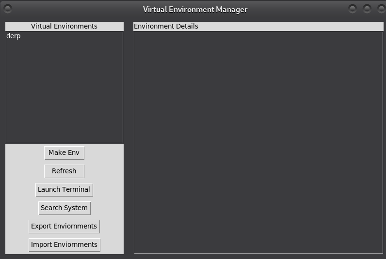

# Python Virtual Environment Manager GUI

This application provides a graphical user interface for managing Python virtual environments. It allows users to create, delete, and manage Python environments and their packages.

## Screenshot

## Features

- List all available Python environments (virtual environments)
- Display detailed information about each environment
- Create new virtual environments 
- Launch a selected virtual enviornment

## Prerequisites

- Python3-full

## Installation

1. Clone this repository:

The GUI will open, allowing you to:

- Select and view information about different Python environments
- Create new virtual environments
- locate existing environments

## Contributing

Contributions are welcome! Please feel free to submit a Pull Request.

## License

This project is licensed under the MIT License - see the [LICENSE](https://opensource.org/license/mit) file for details.
